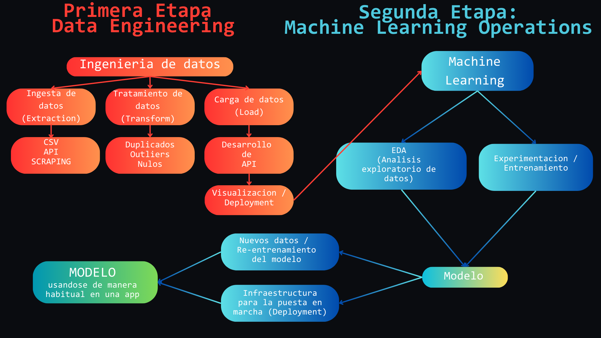

 

# Steam Games Machine Learning Operations + FastAPI

### 🌐 Contexto:

💼 Soy un Cientifico de Datos que trabaja para Steam, una plataforma multinacional de videojuegos y lleve a cabo este trabajo buscando lograr un MVP en un lapso de 7 dias:

### 🎯Objetivos y roles:

1. **🛠️ Data Engineer:**

   - 🛠️ **ETL**: Limpiar y preparar los 📂 dataset de Steam para el análisis.
   - **📂 Feature Engineering:**

     - Desarrollo de las funciones para los endpoints.
     - Preparado de dataset para las consultas de la API.
     - Analisis de sentimiento en las reseñas de los usuarios aplicado con NLP en el dataset.
   - 🌐 **API**:

     - Con endpoints que proporcionarán acceso a los resultados
     - Despliegue automático desde GitHub
2. **🤖 Machine Learning Operations:**

- Implementar un sistema de recomendación de videojuegos para usuarios.
- En general se explican como:“A usuarios que son similares a tí también les gustó…”
- 🤖 Modelo con relación **user-item:** toma un usuario, se encuentran usuarios similares, recibimos una lista con 5 juegos recomendados para dicho usuario.

## **FLUJO DE TRABAJO**

---

## ______ Primera etapa: ______

### Rol: 🛠️Data Engineer

#### 🛠️Empezamos por el proceso **ETL (📦 Extract, 🔄 Transform, 📤 Load)**

**📦 Extraccio**n de datos:

- La fuente de datos para este proyecto fueron 3 **📂 archivos JSON** comprimidos en gz
- Puedes ver el **diccionario de datos** de estos archivos tocando [aquí](https://github.com/bautiarmanicode/MachineLearning/blob/main/1_JupyterNotebooks/0_%20Diccionario_de_datos.md).

🔄 **Transformaciones de los datos:**

- Preparamos los dataset de Steam para la correcta lectura:
- Eliminados columnas irrelevantes para optimizar el rendimiento de la API.
- Eliminados datos faltantes o nulos.
- Eliminados registros o filas repetidas.
- Transformaciones en los tipos de datos.

**📤 Carga de datos limpios**

- Exportamos los archivos en formato parquet por su **peso, eficiencia en la lectura o escritura de datos y acelerando **las consultas****
- Se puede visualizar el proceso 🛠️ ETL en los siguientes links:
  - [🛠️ ETL 📂 steam_games.json](https://github.com/bautiarmanicode/STEAM_GAMES_MLOPS/blob/main/1_JupyterNotebooks/1.1_ETL_steam_games.ipynb)
  - [🛠️ ETL 📂 users_items.json](https://github.com/bautiarmanicode/STEAM_GAMES_MLOPS/blob/main/1_JupyterNotebooks/1.2_ETL_user_items.ipynb)
  - [🛠️ ETL 📂 user_reviews.json](https://github.com/bautiarmanicode/STEAM_GAMES_MLOPS/blob/main/1_JupyterNotebooks/1.3_ETL_user_reviews.ipynb)

### Continuamos haciendo🛠️Feature engineering

- 📂 user_reviews.json: La columna "**sentiment_analysis**" se ha creado para las reseñas de los usuarios aplicando análisis de sentimiento con NLP en el dataset.
- ✅ 🌐 `developer`
- ✅ 🌐 `userdata`
- El desarrollo de este proceso se encuentran en: [2_FeatureEngineering](https://github.com/bautiarmanicode/STEAM_GAMES_MLOPS/blob/main/1_JupyterNotebooks/2_FeatureEngineering.ipynb) .

**🌐 Desarrollo de [API REST o RESTful](https://rockcontent.com/es/blog/api-rest/)**

- El sistema se implementa como una **API** a traves del Framework **FastAPI** , lo que permite a los usuarios interactuar con el modelo a través de solicitudes HTTP desde cualquier dispositivo conectado a internet.

**La API ofrece la funcionalidad para obtener la informacion de los siguientes 5 endpoints** :

1. ✅🌐 `developer(desarrollador:str)`: Devuelve la cantidad de juegos y porcentaje de contenido Free por año según la empresa desarrolladora
2. ✅🌐 `userdata(User_id:str): `Dinero gastado por el usuario, porcentaje de recomendación y cantidad de items.
3. `🌐 UserForGenre(genero)`: Usuario con más horas jugadas para el género dado y acumulación de horas jugadas por año de lanzamiento.
4. `🌐 best_developer_year(año: int)`: Top 3 de desarrolladores con juegos MÁS recomendados por usuarios para el año dado.
5. 🌐 `developer_reviews_analysis(desarrolladora: str)`: Diccionario con el nombre del desarrollador y la cantidad de reseñas positivas y negativas.

**Pasos para ejecutar la api de forma local desde localHost:**

1. 📥 **Clonar el Proyecto:** Usa `git clone https://github.com/bautiarmanicode/STEAM_GAMES_MLOPS/tree/main` para descargar el proyecto.
2. 🛠️ **Preparar el Entorno de Trabajo:**
   * Crea un entorno virtual con `Python -m venv venv`.
   * Activa el entorno con `venv\Scripts\activate`.
   * Instala las dependencias con `pip install -r requirements.txt`.
3. ▶️ **Ejecutar el Servidor:**
   * Inicia el servidor ejecutando `uvicorn main:app --reload` desde la consola.
4. 🌐 **Acceder al Servidor:**
   * Haz clic en la dirección mostrada en la consola ([http://XXX.X.X.X:XXXX](http://xxx.x.x.x:XXXX/)).
5. 📄 **Explorar la Documentación:**
   * Agrega `/docs` en el navegador para acceder a ReDoc y explorar la documentación.
6. 🛠️ **Probar las Funciones:**
   * En cada función, haz clic en *Try it out* , ingresa los datos necesarios o usa los ejemplos predeterminados, y luego ejecuta y observa la respuesta.

#### 🌐 Deployment en Render

- Render es una nube unificada para aplicaciones y sitios web, conoce mas sobre render en este enlace. [Render](https://render.com/docs/free#free-web-services)

**🎯Objetivo:** Despliegue automático desde GitHub

Siguiendo este [tutorial de Render](https://github.com/HX-FNegrete/render-fastapi-tutorial)

1. Creamos un nuevo servicio en Render
2. Lo conectamos a nuestro repositorio.
   1. Para ahorrar espacio en el plan gratuito de Render, utilizamos un repositorio exclusivo para el despliegue con los datos que limpiamos en este proyecto (podes visualizarlo aquí [Github Deployment Render](https://github.com/bautiarmanicode/STEAM_GAMES_MLOPS_RENDERDEPLOY)).
3. Nuestro servicio está corriendo en: [Deployment Render SteamGamesMLOPS](https://machinelearning-xb5s.onrender.com)

**Detalles adicionales:**

* 🛠️ Una vez que toda la data limpia es consumible por la API y tenemos nuestras funciones corriendo procedemos a EDA(Analisis exploratorio de Datos)

---

## ______ Segunda etapa: ______

### 🤖 Machine Learning Operations

1. 🔎 Departamento de Analytics:  Comenzamos con un análisis exploratorio de datos (EDA) para entender bien los datos a los que tenemos acceso.
2. 🤖 Departamento de Machine Learning:  Luego seguimos con el desarrollo de nuestro modelo predictivo.

#### 🔎EDA (Análisis Exploratorio de Datos)

✅ Una vez que toda la data esta limpia gracias al Data Engineer que hizo **🛠️ETL**, hacer 🔎 **EDA** nos permite entender bien los datos a los que tenemos acceso.

Puedes leer un poco más sobre EDA en [este articulo](https://medium.com/swlh/introduction-to-exploratory-data-analysis-eda-d83424e47151)

El codigo usado en esta parte del proceso se encuentra en [3_EDA.ipynb](https://github.com/bautiarmanicode/STEAM_GAMES_MLOPS/blob/main/1_JupyterNotebooks/3_Eda.ipynb)

### 🤖 Departamento de Machine Learning:

Creamos un modelo de predicción **Machine Learning** **recomendacion_juego**( *`user`* ):  Ingresando el id de producto, deberíamos recibir una lista con 5 juegos para dicho usuario.

Para crearlo elegimos, user_id, reviews_item_id y sentyment_analysis.
El modelo fue creado utilizando SVD(Descomposicion en Valores Singulares)

Los detalles de este proceso se encuentran en [4_MachineLearning.ipynb](https://github.com/bautiarmanicode/STEAM_GAMES_MLOPS/blob/main/1_JupyterNotebooks/4_MachineLearning.ipynb)

---

## 📺 Video demostración

📺 Para obtener información detallada sobre los pasos del proceso y una explicación más profunda.

📹 Disfruta la demostracion del funcionamiento de la API y del modelo de ML en el siguiente [enlace](https://drive.google.com/file/d/1Q-1YeWJm4LJDuMtig_XMulJv5PFh_NW1/view?usp=drive_link): (Duración: 6.50 minutos aprox).

¡Disfruta del video! 😊

---

# Criterios de evaluación

- ✅ Codigo:
  - Prolijo
  - Bien comentado
  - Uso de clases y funciones (se encuentran en [data_utils.py ](https://github.com/bautiarmanicode/STEAM_GAMES_MLOPS/blob/main/1_JupyterNotebooks/data_utils.py)y las importo en mis Jupiter Notebooks)
- ✅ Repositorio:
  - Nombres de archivo adecuados
  - Uso de carpetas para ordenar los archivos
  - **README.MD** explicando el proyecto y el trabajo realizado

# Ruta de archivos del proyecto

📂0 Dataset: Contiene todos los datos para este proyecto.

- [0_ Diccionario_de_datos.md](https://github.com/bautiarmanicode/STEAM_GAMES_MLOPS/blob/main/1_JupyterNotebooks/0_%20Diccionario_de_datos.md)

📂1_JupyterNotebooks: Contiene los notebooks con los que se realizo este trabajo.

- [🛠️ ETL 📂 steam_games.json](https://github.com/bautiarmanicode/STEAM_GAMES_MLOPS/blob/main/1_JupyterNotebooks/1.1_ETL_steam_games.ipynb)
- [🛠️ ETL 📂 users_items.json](https://github.com/bautiarmanicode/STEAM_GAMES_MLOPS/blob/main/1_JupyterNotebooks/1.2_ETL_user_items.ipynb)
- [🛠️ ETL 📂 user_reviews.json](https://github.com/bautiarmanicode/STEAM_GAMES_MLOPS/blob/main/1_JupyterNotebooks/1.3_ETL_user_reviews.ipynb)
- [2_FeatureEngineering](https://github.com/bautiarmanicode/STEAM_GAMES_MLOPS/blob/main/1_JupyterNotebooks/2_FeatureEngineering.ipynb)
- [3_EDA.ipynb](https://github.com/bautiarmanicode/STEAM_GAMES_MLOPS/blob/main/1_JupyterNotebooks/3_Eda.ipynb)
- [4_MachineLearning.ipynb](https://github.com/bautiarmanicode/STEAM_GAMES_MLOPS/blob/main/1_JupyterNotebooks/4_MachineLearning.ipynb)
- [data_utils.py ](https://github.com/bautiarmanicode/STEAM_GAMES_MLOPS/blob/main/1_JupyterNotebooks/data_utils.py)
